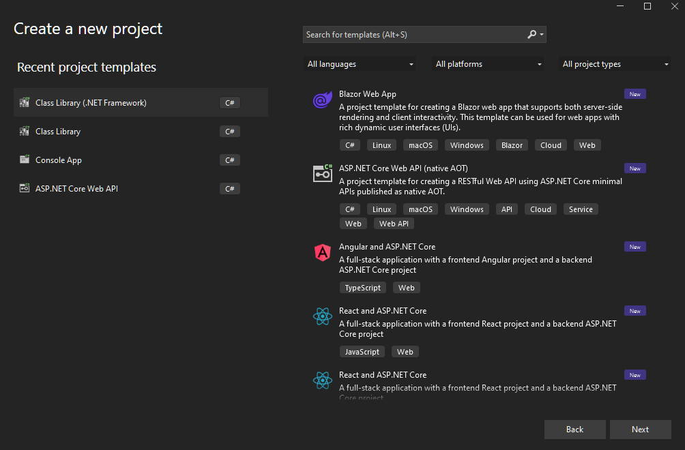
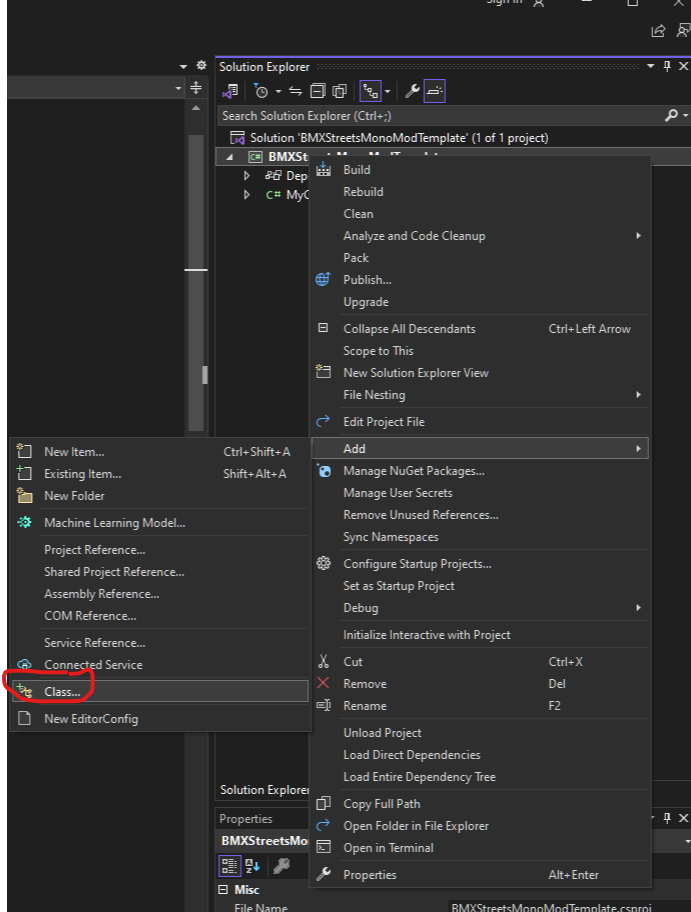
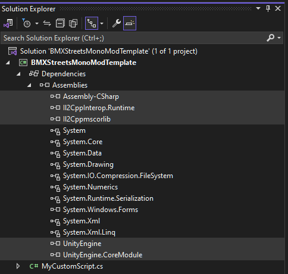
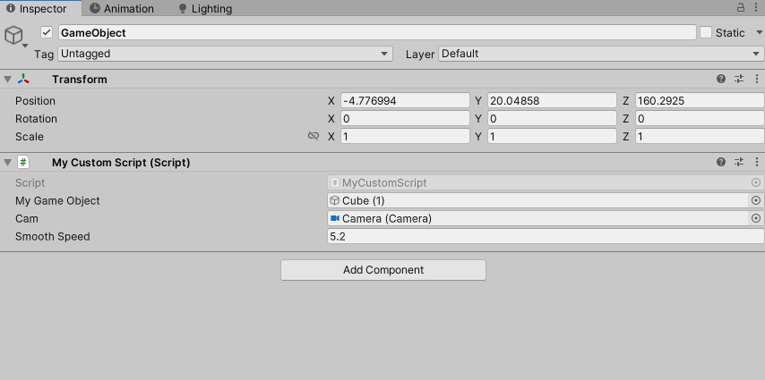
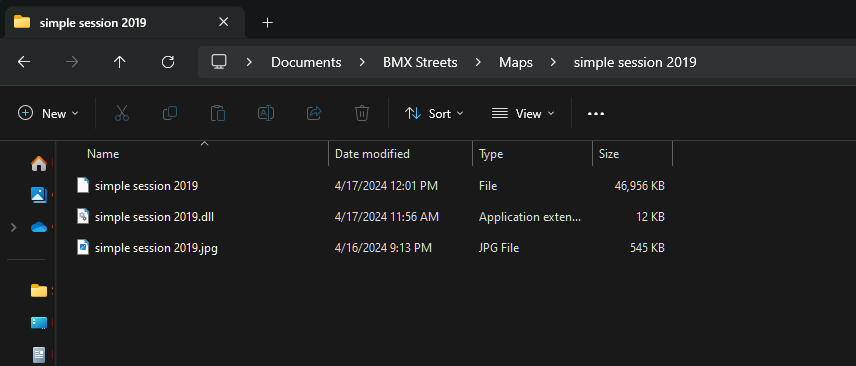

# BMX Streets™ Map DLL Injector Mod

Welcome to the BMX Streets™ Map DLL Injector Mod, a [MelonLoader](https://melonwiki.xyz/#/) mod for the [BMX Streets™](https://store.steampowered.com/app/871540/BMX_Streets/) game available on Steam. This mod enables dynamic loading of custom DLLs for different maps, allowing for custom maps to have unique behaviors via scripting.

## Features

- **Dynamic DLL Loading**: Automatically loads and applies custom DLLs when you load different maps, allowing for map-specific scripting customizations.
- **Enhanced Logging**: Provides detailed logs for both standard operations and errors, helping in troubleshooting issues.
- **Harmony Patch Integration**: Uses Harmony to patch game methods seamlessly, enhancing the game's functionality without altering anything directly.

## Installation

1. **Download the Mod**:
   - Download the [latest release](https://github.com/thejeffreyallen/MapDLLInjector/releases) from the GitHub repository.
2. **Install MelonLoader**:
   - [Download MelonLoader](https://github.com/HerpDerpinstine/MelonLoader/releases/latest/download/MelonLoader.Installer.exe) and ensure that it is installed in your BMX Streets game directory. MelonLoader is necessary for loading mods in BMX Streets™.
3. **Place the Mod Files**:
   - Copy the downloaded mod files into the `Mods` folder in your BMX Streets game directory typically located at `C:\Program Files (x86)\Steam\steamapps\common\BMX Streets\`.

## Usage

Once installed, the mod operates automatically:
- **DLL Loading**: When you load a map, the mod checks for a corresponding DLL in the same directory as the map bundle / image and loads it if found. i.e. `C:\Users\<your_user_name>\Documents\BMX Streets\Maps\<your_map_name>\`
- **Error Handling**: Errors during DLL loading are logged to the MelonLoader console with detailed messages.

## Building DLLs for Your Custom Maps

### Prerequisites:

#### Knowledge
- Some working knowledge of the C sharp language
- Experience using the Unity Editor
- Ability to create a custom map for BMX Streets™

#### Programs

- [Visual Studio: Community Edition](https://visualstudio.microsoft.com/thank-you-downloading-visual-studio/?sku=Community&channel=Release&version=VS2022&source=VSLandingPage&cid=2030&passive=false) 
- [.NET Framework 4.7.2 SDK](https://dotnet.microsoft.com/en-us/download/dotnet-framework/thank-you/net472-developer-pack-offline-installer) (Can likely install as part of the above Visual Studio installer)
- [MelonLoader](https://github.com/HerpDerpinstine/MelonLoader/releases/latest/download/MelonLoader.Installer.exe) Installed and ran the game at least once to generate the DLLs required for referencing in Visual Studio.
- [Unity 2022.3.5f1](https://download.unity3d.com/download_unity/9674261d40ee/Windows64EditorInstaller/UnitySetup64-2022.3.5f1.exe)

#### (optional)
- [Map Mod Template Visual Studio Project](https://www.mediafire.com/file_premium/c24q5aq1y4u7bs1/BMXStreetsMonoModTemplate.zip/file)
- [Unity Explorer](https://thunderstore.io/package/download/sinai-dev/UnityExplorer_IL2CPP_ML/4.8.2/) mod for MelonLoader (This will allow you to inspect your scene in game. Makes debugging a lot easier)

### Visual Studio Section

**1. In Visual Studio, create a new project of type `Class Library (.NET Framework)`**



**2. Create a new class by right clicking on your solution and going to Add -> Class**



**3. Ensure that you are referencing the right dependencies for Unity and the generated Assembly-Csharp from BMX Streets™**

**Dependency Locations**

`NOTE: These paths may vary slightly if you installed the game somewhere else`

- `Assembly-CSharp.dll` -> C:\Program Files (x86)\Steam\steamapps\common\BMX Streets\MelonLoader\Il2CppAssemblies\Assembly-CSharp.dll
- `Il2Cppmscorlib` -> C:\Program Files (x86)\Steam\steamapps\common\BMX Streets\MelonLoader\Il2CppAssemblies\Il2Cppmscorlib.dll
- `Il2CppInterop.Runtime.dll` -> C:\Program Files (x86)\Steam\steamapps\common\BMX Streets\MelonLoader\net6\Il2CppInterop.Runtime.dll
- `UnityEngine.dll` -> C:\Program Files (x86)\Steam\steamapps\common\BMX Streets\MelonLoader\Il2CppAssemblies\UnityEngine.dll
- `UnityEngine.CoreModule.dll` -> C:\Program Files (x86)\Steam\steamapps\common\BMX Streets\MelonLoader\Il2CppAssemblies\UnityEngine.CoreModule.dll



**4. Write your script**

```C#
public class MyCustomScript : MonoBehaviour
{
    // Use Il2CppReferenceField to bind Unity Editor-assigned GameObject and Camera to the script.
    // This allows these objects to be directly manipulated within the script based on their assignments in the editor.
    public Il2CppReferenceField<GameObject> refMyGameObject;
    public Il2CppReferenceField<Camera> refCamera;

    // Use Il2CppValueField for binding primitive types like float. This wrapper is appropriate for simple data types.
    public Il2CppValueField<float> refFloatVal;

    // There is some uncertainty about using Il2CppValueField with strings, as noted by the Il2CppInterop developers.
    // It might not work, but you can experiment to see if it meets your needs.
    // According to the developers of Il2CppInterop, strings may not work with Il2CppValueField<string>. Worth a try though

    // These private fields are for internal use within the script. They will be manually linked to the above Il2Cpp fields in Unity's Start() or Awake() methods.
    // This manual assignment is necessary for the proper initialization and use of these objects and values in your script.
    private GameObject myGameObject;
    private Camera cam;
    private float floatVal;

    // Class Constructor needed for IL2CPP
    public MyCustomScript(IntPtr handle) : base(handle)
    {
       if(handle == IntPtr.Zero)
       {
          // If we see this, we know something went wrong
          Debug.Log("Warning: Handle is zero for MyCustomScript");
       }
       ClassInjector.DerivedConstructorBody(this);
    }

    public void Start()
    {
        Debug.Log("MyCustomScript started.");
        // After these assignments, you're good to use these objects as normal
        this.myGameObject = refMyGameObject.Get();
        this.cam = refCamera.Get();
        this.floatVal = refFloatVal.Get();
    }
    
}
```

### Unity Editor Section

**1. In the Unity Editor, you'll need to create a "dummy" script with the same namespace and class name as the script you made in Visual Studio like this MyCustomScript.cs file:**

```C#
namespace BMXStreetsMonoModTemplate
{
    public class MyCustomScript : MonoBehaviour
    {
        // this will map to public Il2CppReferenceField<GameObject> refMyGameObject from your other script;
        public GameObject myGameObject;
        public Camera cam;
        public float smoothSpeed;
             
        // No support for methods at this time so this is all the "dummy" script will contain
    }
}
```

**2. Apply the script to your GameObject and populate your fields as desired**



**3. Build your asset bundle and put it in the maps folder at `C:\Users\<your_user_name>\Documents\BMX Streets\Maps\<your_map_name>\`**

**4. Build your DLL and name to match your map <your_map_name>.dll then move it to the `C:\Users\<your_user_name>\Documents\BMX Streets\Maps\<your_map_name>\` folder** 

Example (the jpg is optional):



**5. Test your map**

Open the game and load your custom map. You can use the [Unity Explorer](https://thunderstore.io/package/download/sinai-dev/UnityExplorer_IL2CPP_ML/4.8.2/) mod to check and verify that your objects have been attached automatically to your script and vice versa.

## Helpful Resources

- **[Volution Modding Discord](https://discord.gg/CX56NRS87D)**
- **[Unity 2022 Scripting API](https://docs.unity3d.com/2021.3/Documentation/ScriptReference/)**
- **[Harmony Documentation](https://harmony.pardeike.net/articles/intro.html)**

## Mod Components

### Mod.cs

An entry point class extending `MelonMod` that applies Harmony patches at the game's startup.

### Logger.cs

A utility class that provides colored logging capabilities:
- Green for standard messages.
- Red for error messages.

### UGCSceneSOPatch.cs

A Harmony patch for the `UGCSceneSO.Load` class, responsible for:
- Injecting the necessary DLLs based on the current map.
- Handling the entire lifecycle of DLL loading from verification to execution.
- Logging all significant actions and errors for better traceability.

## Contributing

Contributions are welcome! If you have improvements or bug fixes, please fork the repository and submit a pull request.

## License

This project is licensed under the MIT License - see the [LICENSE.md](LICENSE.md) file for details.

Happy modding
